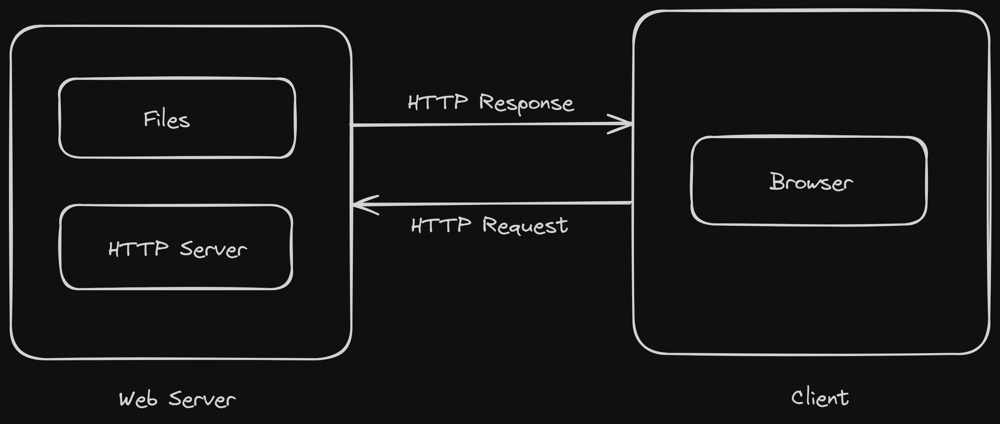

# HTTP Server

This project is a simple HTTP server implemented in C++. It listens for incoming connections on a specified port, accepts these connections, and logs the IP address and port number of each client that connects.



## Building the Project

This project uses CMake for its build system. To build the project, follow these steps:

1. Open a terminal and navigate to the project's root directory.

2. Create a new directory named `build` and navigate into it:

    ```sh
    mkdir build
    cd build
    ```

3. Run CMake to generate a Makefile:

    ```sh
    cmake ..
    ```

4. Run `make` to build the project:

    ```sh
    make
    ```

## Running the Server

After building the project, you can run the server with the following command:

```sh
./Http